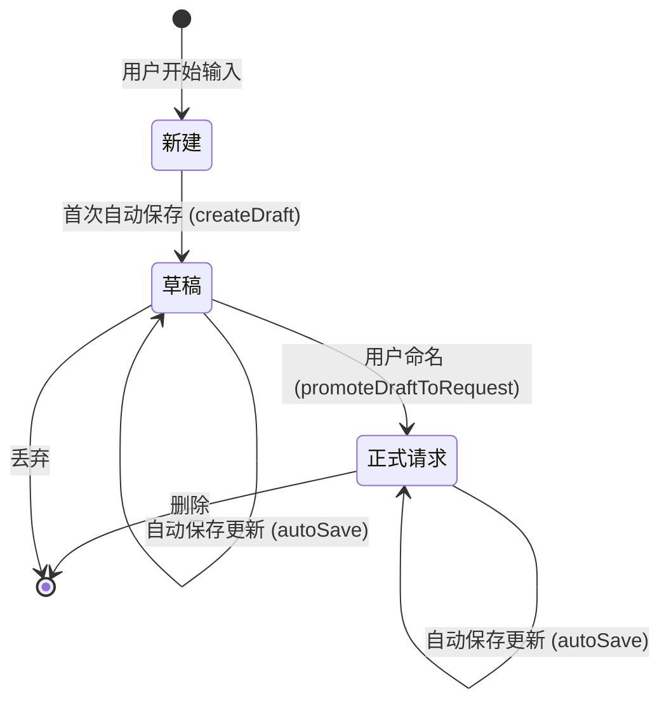
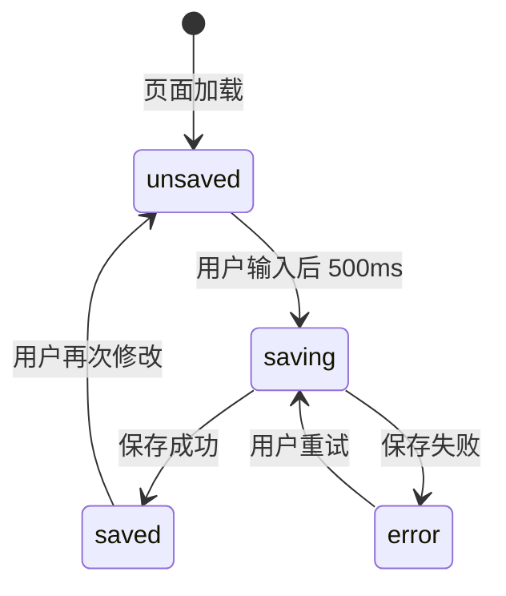

# 数据模型定义 - 请求自动保存

**Feature**: 请求实时自动保存  
**Created**: 2025-10-11  
**Status**: Completed

---

## 1. 核心实体

### 1.1 Request (请求)

**描述**: 表示一个 HTTP 请求，包括正式请求和草稿请求。

**接口定义** (`src/models/request.ts`):
```typescript
export interface Request {
    /** 唯一标识符 (格式: req-{timestamp} 或 draft-{timestamp}) */
    id: string;
    
    /** 请求名称 (草稿可为空) */
    name: string;
    
    /** 所属文件夹 ID */
    folder_id: string;
    
    /** 请求 URL */
    url: string;
    
    /** HTTP 方法 */
    method: string;
    
    /** 请求头 (支持数组或对象格式) */
    headers?: Array<{ key: string; value: string }> | Record<string, string>;
    
    /** 请求体 */
    body?: string;
    
    /** 创建时间戳 */
    created_at: number;
    
    /** 最后更新时间戳 */
    updated_at: number;
    
    /** 是否为草稿 (新增字段) */
    is_draft: boolean;
}
```

**字段约束**:
- `id`: 必填，全局唯一
  - 正式请求: `req-{timestamp}`
  - 草稿请求: `draft-{timestamp}`
- `name`: 可选，草稿可为空字符串
- `folder_id`: 必填，引用 `Directory.id`
- `url`: 必填，最小长度 1
- `method`: 必填，默认 `"GET"`
- `is_draft`: 必填，布尔值
- `created_at`, `updated_at`: 必填，Unix 时间戳（毫秒）

**状态转换**:


**示例数据**:
```json
{
  "id": "draft-1697000010000",
  "name": "",
  "folder_id": "folder-001",
  "url": "https://api.example.com/products",
  "method": "POST",
  "headers": [
    { "key": "Content-Type", "value": "application/json" },
    { "key": "Authorization", "value": "Bearer token123" }
  ],
  "body": "{\"name\": \"Product 1\"}",
  "created_at": 1697000010000,
  "updated_at": 1697000015000,
  "is_draft": true
}
```

---

### 1.2 Directory (文件夹)

**描述**: 请求的组织容器（现有实体，不修改）。

**接口定义** (参考):
```typescript
export interface Directory {
    id: string;
    name: string;
    parent_id?: string;
    created_at: number;
    updated_at: number;
}
```

**关系**: 一个 Directory 可包含多个 Request (1:N)

---

## 2. 服务层接口

### 2.1 RequestService

**文件**: `src/services/requestService.ts`

#### 新增方法

##### `createDraft(data: Partial<Request>): Request | null`

**描述**: 创建草稿请求

**参数**:
```typescript
{
  url: string;              // 必填
  method?: string;          // 可选，默认 "GET"
  headers?: Array<{ key: string; value: string }>;
  body?: string;
  folder_id?: string;       // 可选，默认使用第一个文件夹或创建默认文件夹
}
```

**返回**: 创建的草稿请求对象，失败返回 `null`

**逻辑**:
1. 生成草稿 ID: `draft-${Date.now()}`
2. 设置默认值:
   - `name`: 空字符串
   - `is_draft`: `true`
   - `created_at`, `updated_at`: 当前时间戳
3. 确定 `folder_id`: 优先使用传入值，否则使用默认文件夹
4. 保存到 `requests.json`
5. 返回草稿对象

**示例**:
```typescript
const draft = requestService.createDraft({
  url: 'https://api.example.com/users',
  method: 'GET'
});
// 返回: { id: 'draft-1697000010000', name: '', is_draft: true, ... }
```

---

##### `promoteDraftToRequest(draftId: string, name: string): Request | null`

**描述**: 将草稿转为正式请求

**参数**:
- `draftId`: 草稿请求的 ID
- `name`: 新的请求名称（必填，非空）

**返回**: 转换后的正式请求对象，失败返回 `null`

**逻辑**:
1. 查找草稿请求（验证 `is_draft === true`）
2. 生成新的正式请求 ID: `req-${Date.now()}`
3. 更新字段:
   - `id`: 新 ID
   - `name`: 传入的名称
   - `is_draft`: `false`
   - `updated_at`: 当前时间戳
4. 删除原草稿
5. 保存正式请求
6. 返回正式请求对象

**示例**:
```typescript
const request = requestService.promoteDraftToRequest(
  'draft-1697000010000',
  'Get Users API'
);
// 返回: { id: 'req-1697000020000', name: 'Get Users API', is_draft: false, ... }
```

---

##### `autoSave(requestData: Partial<Request>): { success: boolean; request?: Request; error?: string }`

**描述**: 自动保存请求（创建草稿或更新现有请求）

**参数**:
```typescript
{
  id?: string;              // 如果有 ID，则更新现有请求
  name?: string;
  url: string;
  method: string;
  headers?: Array<{ key: string; value: string }>;
  body?: string;
  folder_id?: string;
  is_draft?: boolean;       // 如果更新现有请求，保持原值
}
```

**返回**:
```typescript
{
  success: boolean;         // 操作是否成功
  request?: Request;        // 成功时返回请求对象
  error?: string;           // 失败时返回错误信息
}
```

**逻辑**:
1. **如果有 `id`** (更新现有请求):
   - 查找现有请求
   - 如果不存在，返回错误
   - 更新字段（保持 `id`, `is_draft`, `created_at` 不变）
   - 更新 `updated_at`
   - 保存
2. **如果无 `id`** (创建草稿):
   - 调用 `createDraft(requestData)`
   - 返回新草稿对象
3. 返回操作结果

**示例**:
```typescript
// 场景 1: 创建新草稿
const result1 = requestService.autoSave({
  url: 'https://api.example.com/products',
  method: 'POST'
});
// 返回: { success: true, request: { id: 'draft-...', is_draft: true } }

// 场景 2: 更新现有请求
const result2 = requestService.autoSave({
  id: 'req-1697000010000',
  url: 'https://api.example.com/products?page=2',
  method: 'GET'
});
// 返回: { success: true, request: { id: 'req-1697000010000', url: '...?page=2' } }
```

---

##### `getAllDrafts(): Request[]`

**描述**: 获取所有草稿请求

**返回**: 草稿请求数组

**逻辑**:
```typescript
getAllDrafts(): Request[] {
    return Array.from(this.requests.values())
        .filter(req => req.is_draft === true);
}
```

---

#### 修改方法

##### `loadRequests()` - 添加数据迁移

```typescript
private loadRequests() {
    try {
        if (fs.existsSync(this.storageFile)) {
            const data = JSON.parse(fs.readFileSync(this.storageFile, 'utf8')) as Request[];
            data.forEach(request => {
                // 【新增】向后兼容：现有请求默认不是草稿
                if (request.is_draft === undefined) {
                    request.is_draft = false;
                }
                this.requests.set(request.id, request);
            });
        } else {
            this.saveRequests(); // 创建空文件
        }
    } catch (error) {
        console.error('加载请求失败:', error);
    }
}
```

---

## 3. 消息通信协议

### 3.1 Webview → Extension

#### `autoSaveRequest` (新增)

**描述**: 触发自动保存

**消息格式**:
```typescript
{
  command: 'autoSaveRequest',
  data: {
    id?: string,                      // 可选，更新现有请求时传入
    name?: string,                    // 可选，草稿可为空
    url: string,                      // 必填
    method: string,                   // 必填
    headers: Array<{ key: string; value: string }>,
    body: string,
    folder_id?: string,               // 可选
    is_draft?: boolean,               // 可选，更新时保持原值
    silent: boolean                   // 是否静默保存（不显示成功提示）
  }
}
```

**响应**: 通过 `updateSaveStatus` 消息返回结果

---

#### `promoteDraft` (新增)

**描述**: 将草稿转为正式请求

**消息格式**:
```typescript
{
  command: 'promoteDraft',
  data: {
    draftId: string,                  // 草稿 ID
    name: string                      // 新请求名称
  }
}
```

**响应**: 通过 `updateRequestData` 消息加载转换后的请求

---

### 3.2 Extension → Webview

#### `updateSaveStatus` (新增)

**描述**: 更新保存状态

**消息格式**:
```typescript
{
  command: 'updateSaveStatus',
  status: 'saved' | 'saving' | 'unsaved' | 'error',
  message?: string,                   // 错误信息（status 为 error 时）
  request_id?: string                 // 新创建的请求 ID
}
```

**处理逻辑** (Webview):
```typescript
case 'updateSaveStatus':
    updateSaveIndicator(message.status, message.message);
    
    // 如果是新创建的草稿，保存 ID 供后续更新使用
    if (message.request_id && !currentRequest) {
        currentRequest = { id: message.request_id, is_draft: true };
    }
    break;
```

---

#### `updateRequestData` - 添加 `is_draft` 字段

**描述**: 加载请求数据到面板（现有消息，添加字段）

**消息格式**:
```typescript
{
  command: 'updateRequestData',
  data: {
    id: string,
    name: string,
    url: string,
    method: string,
    headers: Array<{ key: string; value: string }>,
    body: string,
    folder_id: string,
    is_draft: boolean                 // 【新增】
  }
}
```

**处理逻辑** (Webview):
```typescript
case 'updateRequestData':
    currentRequest = message.data;
    
    // 更新 UI
    document.getElementById('request-name').value = message.data.name;
    document.getElementById('url').value = message.data.url;
    // ...
    
    // 如果是草稿，显示"保存为正式请求"按钮
    if (message.data.is_draft) {
        document.getElementById('promote-draft-btn')?.classList.remove('hidden');
    } else {
        document.getElementById('promote-draft-btn')?.classList.add('hidden');
    }
    break;
```

---

## 4. UI 状态管理

### 4.1 SaveIndicator (保存状态指示器)

**状态枚举**:
```typescript
type SaveStatus = 'saved' | 'saving' | 'unsaved' | 'error';
```

**状态转换**:


**UI 映射**:

| 状态 | 图标 | 文本 | 颜色 | 背景色 |
|------|------|------|------|--------|
| `saved` | ✓ | 已保存 | 绿色 | 浅绿 |
| `saving` | ⏳ | 保存中... | 黄色 | 浅黄 |
| `unsaved` | ● | 有未保存更改 | 灰色 | 浅灰 |
| `error` | ✗ | 保存失败 | 红色 | 浅红 |

---

### 4.2 CurrentRequest (当前请求状态)

**全局变量** (Webview):
```typescript
let currentRequest: {
    id?: string;
    is_draft?: boolean;
    // ... 其他字段
} | null = null;
```

**作用**:
- 标识当前编辑的请求
- 决定自动保存时是创建还是更新
- 控制 UI 显示（如草稿按钮）

**更新时机**:
1. 加载请求时 (`updateRequestData` 消息)
2. 首次自动保存创建草稿后 (`updateSaveStatus` 消息返回 `request_id`)
3. 草稿转为正式请求后 (`updateRequestData` 消息)

---

## 5. 数据验证规则

### 5.1 Request 验证

**创建草稿时**:
- `url`: 必填，最小长度 1
- `method`: 默认 `"GET"`
- 其他字段: 可选

**转为正式请求时**:
- `name`: 必填，非空字符串，最大长度 100

**自动保存时**:
- 如果 `id` 存在，必须在 `requests` Map 中找到对应请求

---

## 6. 数据持久化

### 6.1 存储格式

**文件**: `{globalStoragePath}/requests.json`

**格式**: JSON 数组
```json
[
  {
    "id": "req-1697000010000",
    "name": "Get Users",
    "is_draft": false,
    "url": "https://api.example.com/users",
    "method": "GET",
    "headers": [
      { "key": "Content-Type", "value": "application/json" }
    ],
    "body": "",
    "folder_id": "folder-001",
    "created_at": 1697000010000,
    "updated_at": 1697000010000
  },
  {
    "id": "draft-1697000020000",
    "name": "",
    "is_draft": true,
    "url": "https://api.example.com/products",
    "method": "POST",
    "headers": [],
    "body": "{\"test\": true}",
    "folder_id": "folder-001",
    "created_at": 1697000020000,
    "updated_at": 1697000025000
  }
]
```

### 6.2 保存策略

**原子性写入**:
```typescript
private saveRequests() {
    try {
        const data = Array.from(this.requests.values());
        const tempFile = this.storageFile + '.tmp';
        
        // 先写入临时文件
        fs.writeFileSync(tempFile, JSON.stringify(data, null, 2), 'utf8');
        
        // 重命名（原子操作）
        fs.renameSync(tempFile, this.storageFile);
    } catch (error) {
        console.error('保存请求失败:', error);
        throw error;
    }
}
```

---

## 7. 错误处理

### 7.1 常见错误场景

| 错误场景 | 错误码 | 处理策略 |
|----------|--------|----------|
| 请求 ID 不存在 | `REQUEST_NOT_FOUND` | 返回错误，提示用户刷新 |
| 文件写入失败 | `SAVE_ERROR` | 重试 3 次，失败后提示用户 |
| 文件夹不存在 | `FOLDER_NOT_FOUND` | 自动创建默认文件夹 |
| 草稿转换时 ID 不是草稿 | `NOT_A_DRAFT` | 返回错误，阻止操作 |

### 7.2 错误响应格式

```typescript
{
  success: false,
  error: {
    code: 'REQUEST_NOT_FOUND',
    message: '请求不存在，可能已被删除',
    recoverable: true          // 是否可重试
  }
}
```

---

## 8. 总结

### 核心变更

1. **Request 接口**: 添加 `is_draft: boolean` 字段
2. **RequestService**: 新增 4 个方法 (`createDraft`, `promoteDraftToRequest`, `autoSave`, `getAllDrafts`)
3. **消息协议**: 新增 2 条消息 (`autoSaveRequest`, `updateSaveStatus`)
4. **UI 状态**: 新增保存状态指示器和草稿按钮

### 向后兼容

- 现有请求加载时自动设置 `is_draft: false`
- 不影响现有 CRUD 操作
- 保持 `requests.json` 文件格式兼容

