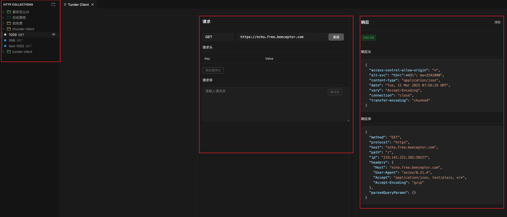

# Tunder Client

轻量级的 VS Code REST API 客户端插件，专注于**简洁性、清晰的设计和本地存储**。

> 免费！ 永远免费

## 主要特性

* **轻量级**：简单易用的 REST API 客户端
* **本地存储**：所有数据保存在用户本地设备上
* **请求管理**：支持文件夹组织和管理 API 请求
* **直观的界面**：
  * 彩色标记的 HTTP 方法（GET、POST、PUT 等）
  * 文件夹树状结构展示
  * 简洁的请求编辑界面

## 界面预览

* 请求列表视图
  * 使用不同颜色区分 HTTP 方法
  * 树状文件夹结构
  * 简洁的请求名称显示
* 请求编辑视图
  * 格式化的请求体编辑器
  * 优化尺寸的发送按钮
  * 响应数据实时预览

## 如何使用

1. 安装扩展后，点击 VS Code 活动栏上的 Tunder Client 图标
2. 在侧边栏中点击新建请求按钮开始测试 API
3. 使用文件夹功能组织和管理你的 API 请求

## 技术特点

* 基于 VS Code 扩展开发
* 使用 TypeScript 开发
* 支持本地数据存储
* 遵循 VS Code 设计规范

## 开发计划

- [x] 基础 HTTP 请求功能
- [x] 请求管理和组织
- [x] UI 优化和美化
- [ ] 环境变量支持
- [ ] 请求历史记录
- [ ] 响应数据导出

## 贡献

这是一个个人项目，主要用于学习和个人使用。如果你有任何建议或想法，欢迎提出。【主要是cursor写的

## 关于

Tunder Client 是一个轻量级的 VS Code REST API 客户端扩展，专注于提供简单、直观的 API 测试体验。